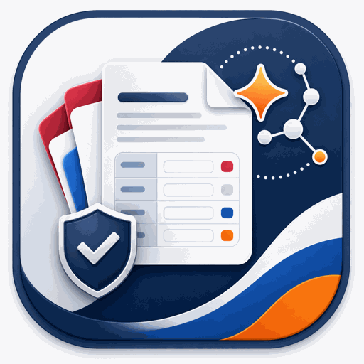

<div align="center">



<h1>NL Tax Agent Skills</h1>

<p>
  <strong>Turn scattered Dutch tax paperwork into a reviewable, source-cited workpack for manual Mijn Belastingdienst entry.</strong>
  <br />
  <sub>An Agent Skills plugin for Claude Code, Cowork, and Codex — annual 2025 &amp; voorlopige aanslag 2026.</sub>
</p>

<br />
<br />

<a href="LICENSE"></a>
<a href="https://claude.com/claude-code"></a>
<a href="https://claude.ai"></a>
<a href="#install"></a>
<a href="#supported-workflows"></a>

<br />
<br />

<a href="#what-it-does">What it does</a>
&nbsp;&nbsp;·&nbsp;&nbsp;
<a href="#how-it-works">How it works</a>
&nbsp;&nbsp;·&nbsp;&nbsp;
<a href="#quickstart">Quickstart</a>
&nbsp;&nbsp;·&nbsp;&nbsp;
<a href="#install">Install</a>
&nbsp;&nbsp;·&nbsp;&nbsp;
<a href="#supported-workflows">Workflows</a>
&nbsp;&nbsp;·&nbsp;&nbsp;
<a href="#architecture--data-flow">Architecture</a>
&nbsp;&nbsp;·&nbsp;&nbsp;
<a href="#skill-inventory">Skills</a>
&nbsp;&nbsp;·&nbsp;&nbsp;
<a href="#privacy-boundary">Privacy</a>

</div>

<br />

> [!NOTE]
> This plugin **prepares workpacks for review**. It is not tax advice. Submission to the Belastingdienst is manual.

---

## What it does

Filing Dutch income tax means a yearly slog of chasing documents, decoding **Mijn Belastingdienst** fields, and keeping track of box 3 rules that change every year — only to repeat the process months later for the voorlopige aanslag.

Off-the-shelf tax software wraps the official forms in its own interface. This plugin keeps you in Mijn Belastingdienst while handling the gathering, classification, and field mapping up to the point of manual entry.

There is no autonomous filing. By design, the skills read a bundled, source-cited knowledge pack instead of fetching live web pages at runtime.

---

## How it works

*No tax or technical background is needed — the entire workflow comes down to four steps.*

<table>
  <tr>
    <td align="center" width="64">📂</td>
    <td>
      <strong>1 &nbsp;Share your documents</strong><br />
      Attach your jaaropgaaf, mortgage statement, bank overview, and similar papers in the chat, or place them in an <code>uploads/</code> folder. You can also state amounts directly in the conversation.
    </td>
  </tr>
  <tr>
    <td align="center">🔎</td>
    <td>
      <strong>2 &nbsp;The assistant reads and sorts them</strong><br />
      It determines what each document is and where it belongs in your tax return, using the official 2025 / 2026 Dutch tax rules. Every rule note cites a registered source.
    </td>
  </tr>
  <tr>
    <td align="center">📋</td>
    <td>
      <strong>3 &nbsp;You receive a clear, reviewable summary</strong><br />
      A “workpack” lists every amount, its source, and any open questions, so you can verify the numbers before anything goes near the tax office.
    </td>
  </tr>
  <tr>
    <td align="center">✅</td>
    <td>
      <strong>4 &nbsp;You enter the numbers yourself</strong><br />
      A final field map connects each reviewed amount to its Mijn Belastingdienst field for you to enter and verify.
    </td>
  </tr>
</table>

---

## Quickstart

Once the plugin is [installed](#install), the workflow is a short chain of slash commands. Each skill consumes the previous skill's output and writes its own output to a scoped path under `workspace/`.

### Annual return — 2025

```text
/nl-tax-agent-skills:nl-tax-intake annual
/nl-tax-agent-skills:nl-tax-evidence-indexer uploads/
/nl-tax-agent-skills:nl-tax-annual-return 2025
/nl-tax-agent-skills:nl-tax-field-mapper annual 2025
/nl-tax-agent-skills:nl-tax-submit-companion annual 2025
```

### Voorlopige aanslag — 2026

Swap in:

```text
nl-tax-provisional-assessment 2026 <request|change|review|stopzetten>
```

In Claude Code, the plugin's skills are directly slash-invokable. If a skill and a `commands/` wrapper share a name, the skill takes precedence. In Codex, invoke the registered skills by name after discovery.

> [!IMPORTANT]
> Test manual-only skill behavior in your target Claude Code version before relying on it. If `disable-model-invocation: true` is not respected for plugin skills in that version, use permission rules to deny unsafe skills or move manual-only skills to standalone project/user skills.

---

## Install

### Claude Code

Install from the marketplace:

```text
/plugin marketplace add cyanxxy/nl-tax-agent-skills
/plugin install nl-tax-agent-skills@nl-tax-agent-skills-marketplace
```

Or run the plugin locally without installing the marketplace:

```bash
claude --plugin-dir ./plugins/nl-tax-agent-skills
```

### Claude Cowork — personal

<sup><em>Public repository supported</em></sup>

1. Open Claude Desktop → **Cowork** → **Customize** → **Browse plugins** → **Personal**.
2. Select **+** → **Add marketplace from GitHub**, then enter `https://github.com/cyanxxy/nl-tax-agent-skills`.
3. Select **Install** on the `nl-tax-agent-skills` entry.

Public GitHub repositories are accepted for personal marketplaces — no fork or ZIP upload is required.

### Host compatibility

| Host | Discovery path | Implicit-invocation control | Status |
|---|---|---|---|
| Claude Code | `.claude-plugin/marketplace.json` → nested plugin | `disable-model-invocation` / `user-invocable` frontmatter | Supported |
| Cowork | Same `.claude-plugin/marketplace.json` — personal or organization marketplace | Same Claude frontmatter | Supported |
| Codex | `.agents/plugins/marketplace.json` → nested plugin | `agents/openai.yaml` with `policy.allow_implicit_invocation: false` | Compatible — see note |

Cowork runs shell/code execution in an isolated local VM. The skills therefore
resolve bundled plugin files with `Read`/`Glob`-style host file tools, not by
asking Bash to find the plugin cache path. Bundled Python helpers are
best-effort in Cowork: if Bash cannot see the resolved plugin script path, the
skills fall back to manual validation from the same references instead of
copying scripts into `workspace/`.

Codex implicit-invocation control is enforced structurally through each non-user-invocable skill's `agents/openai.yaml` and statically validated by `validate_invocation_policy.py`. It has not been integration-tested in a live Codex host, so verify it in your target build before release.

<details>
<summary><strong>Other installation paths</strong> — Cowork team/organization, community directory, Codex, and ZIP fallback</summary>

<br />

#### Cowork — team / enterprise

<sup><em>Private fork required</em></sup>

Cowork's organization marketplace accepts only **private or internal** GitHub repositories. Fork or mirror this repository privately under your organization, then open **Organization settings → Plugins → Add plugin → GitHub**, enter `your-org/your-fork`, and set availability to *Available*, *Installed by default*, *Not available*, or *Required*.

#### Community directory

Open-source plugins can be submitted to the Anthropic community directory at [clau.de/plugin-directory-submission](https://clau.de/plugin-directory-submission). Accepted plugins install from the in-product catalog without marketplace setup or forking.

#### Codex

Discovery uses two files. `.agents/plugins/marketplace.json`, the repository-scoped marketplace, points Codex to `plugins/nl-tax-agent-skills/`, which contains the required `.codex-plugin/plugin.json`.

Codex indexes each skill's `name`, `description`, and path, then loads the full `SKILL.md` when the skill is selected. It does not honor the Claude `disable-model-invocation`, `user-invocable`, or `allowed-tools` keys, so manual-only and background skills include `agents/openai.yaml` with `policy.allow_implicit_invocation: false`.

See [CONTRIBUTING.md](CONTRIBUTING.md#cross-host-invocation-policy).

#### ZIP fallback

Use this path if the GitHub marketplace is unavailable in your host build:

```bash
cd plugins/nl-tax-agent-skills
zip -r ../../nl-tax-agent-skills.plugin.zip . \
  -x "*.DS_Store" -x "__MACOSX/*" -x ".git/*" -x ".claude/*" \
  -x ".agents/*" -x ".codex/*" -x "workspace/*" -x "uploads/*" \
  -x "evidence/*" -x "__pycache__/*" -x "*.pyc"
```

Upload the ZIP through the same **Browse plugins** modal. Versioning and release mechanics are documented in [CONTRIBUTING.md](CONTRIBUTING.md#release-process).

</details>

---

## Supported workflows

| Workflow | Year | Output |
|---|:---:|---|
| Annual income-tax return | **2025** | `workspace/annual/2025/return-pack.md` |
| Voorlopige aanslag — request | **2026** | `workspace/provisional/2026/provisional-pack.md` + field map |
| Voorlopige aanslag — change | **2026** | provisional pack, field map, delta summary |
| Voorlopige aanslag — review | **2026** | provisional pack, review questions |
| Voorlopige aanslag — stopzetten | **2026** | guided support checklist |
| Annual return / Voorlopige aanslag | 2027 | *blocked until 2027 sources are registered and validated* |

> [!WARNING]
> **Box 3 rule split.** Annual 2025 collects both methods — **fictitious (forfaitair)** and **werkelijk rendement** — and presents a comparison for the user to choose from. Provisional 2026 uses **fictitious only**; werkelijk rendement is never requested in any provisional flow.

Active declarations live in [`supported-workflows.yaml`](plugins/nl-tax-agent-skills/skills/_shared/supported-workflows.yaml). A workflow is supported only when its workflow/year pair has reviewed source-register entries, local knowledge snapshots, and passing validators.

The plugin must not reuse 2025/2026 rates, thresholds, field maps, or box 3 logic for 2027.

---

## Architecture & data flow

```text
  uploads/*  ──▶  nl-tax-evidence-indexer  ──▶  workspace/taxpayer/evidence-index.yaml
                                                          │
  (interactive) ──▶  nl-tax-intake          ──▶  workspace/taxpayer/profile.yaml
                                                          │
                       ┌──────────────────────────────────┤
                       ▼                                  ▼
              nl-tax-annual-return            nl-tax-provisional-assessment
                  (2025)                              (2026)
                       │                                  │
                       │  ── pulls background helpers ──┐
                       │     nl-tax-box1-home           │  write notes, assumptions,
                       │     nl-tax-box2                │  and missing-info to
                       │     nl-tax-box3                │  workspace/shared/*.md
                       │     nl-tax-partner-deductions  │
                       │  ──────────────────────────────┘
                       ▼                                  ▼
        workspace/annual/2025/             workspace/provisional/2026/
          return-pack.md                     provisional-pack.md
          field-map.yaml                     field-map.yaml
                                             delta-summary.md      (change/review)
                                             review-questions.md   (review only)
                       │                                  │
                       └──────────────────┬───────────────┘
                                          ▼
                              nl-tax-field-mapper  ──▶  rendered manual-entry table
                                          │
                                          ▼
                            nl-tax-submit-companion  ──▶  human submit checklist
                                          │
                                          ▼
                            [you type into Mijn Belastingdienst]
```

Skills compose without hidden state: each one consumes upstream files and writes to a scoped path. Background helpers — `box1-home`, `box2`, `box3`, and `partner-deductions` — write **only** to `workspace/shared/`.

The skills are instructed to trace every value in a workpack to evidence, profile data, a calculation that cites a `source_id`, or a logged assumption. Review the workpack to confirm this before entry.

The full annotated `workspace/` tree and skill-authoring internals are documented in [CONTRIBUTING.md](CONTRIBUTING.md).

---

## Skill inventory

| Skill | Type | Responsibility |
|---|---|---|
| `nl-tax-intake` | user entry | Screen scope, route to a supported workflow, write `workspace/taxpayer/profile.yaml` |
| `nl-tax-evidence-indexer` | user entry | Hash and index local evidence files, classify without deciding tax treatment |
| `nl-tax-annual-return` | user entry | Prepare `workspace/annual/2025/return-pack.md` and an annual field map |
| `nl-tax-provisional-assessment` | user entry | Prepare 2026 request, change, review, and stopzetten packages |
| `nl-tax-field-mapper` | user entry | Convert workpack findings into manual-entry field maps and review tables |
| `nl-tax-submit-companion` | manual-only | Produce a human checklist for official Belastingdienst submission |
| `nl-tax-box1-home` | background | Summarize box 1 and eigen-woning facts into `workspace/shared/` |
| `nl-tax-box2` | background | Prepare Box 2 substantial-interest notes into `workspace/shared/` |
| `nl-tax-box3` | background | Classify assets and produce annual/provisional box 3 notes without mixing methods |
| `nl-tax-partner-deductions` | background | Determine fiscal-partner and allocation notes for the main workpack |
| `nl-tax-source-refresh` | developer | Validate and refresh local source snapshots and workflow declarations |

Top-level workflow skills own `workspace/annual/**` and `workspace/provisional/**`. Background helpers write only to `workspace/shared/`.

---

## Privacy boundary

Taxpayer files stay out of version control. They live only in git-ignored paths: `workspace/`, `uploads/`, and `evidence/`.

Be clear about what this does and does not mean. The skills run **inside an LLM agent host** — Claude Code, Cowork, or Codex — that reads these files to perform its work. Evidence and workpack content is therefore processed by that host's model under its data-handling terms.

In Cowork, shell commands and code run in an isolated VM. That protects the main
OS boundary, but it is not a privacy guarantee: Claude still has access to the
local folders you connect and can make real changes there.

The git-ignore boundary keeps taxpayer data out of the repository and any fork or marketplace. It is **not** an offline guarantee or a promise that “data never leaves your machine.” These are plaintext files, and the plugin never deletes them for you.

The “no live web fetch” posture is also a convention of the skills, not a host restriction; the host model may still have web tools. For hard blocks on network access or out-of-scope reads, configure host deny-rules, hooks, and OS-level sandboxing.

See [PRIVACY.md](PRIVACY.md) for data retention, cleanup, and sync/backup guidance. See [SECURITY.md](SECURITY.md) to report a sensitive issue.

Tax-content correctness — including rates, thresholds, rules, and cited sources — is owned by the tax-content owner. Report suspected inaccuracies or stale sources through GitHub Issues.

---

## Source register & knowledge pack

Taxpayer-facing skills read a bundled knowledge pack — not live websites — under `plugins/nl-tax-agent-skills/skills/_shared/`:

```text
knowledge/            # source-cited rule notes (laws, own-home, partners, box2/box3, years/…)
source-register.yaml  # every cited source_id with metadata (url, snapshot, freshness, owner)
supported-workflows.yaml
```

Every rule note must cite a `source_id` registered in [`source-register.yaml`](plugins/nl-tax-agent-skills/skills/_shared/source-register.yaml). Only `nl-tax-source-refresh` maintains snapshots.

The active supported pairs are **annual return 2025** and **provisional assessment 2026**. **2027 is blocked** until official sources are registered and validated.

The register schema, freshness gate, and process for adding a source are documented in [CONTRIBUTING.md](CONTRIBUTING.md#source-register--knowledge-pack).

---

## Contributing

Skill-authoring internals, the full validation gate, package layout, and release process are documented in [**CONTRIBUTING.md**](CONTRIBUTING.md).

CI runs the full gate on every push and pull request.

---

<div align="center">

<sub>
  Licensed under <a href="LICENSE">Apache-2.0</a>
  &nbsp;&nbsp;·&nbsp;&nbsp;
  Built for Claude Code, Cowork, and Codex
  &nbsp;&nbsp;·&nbsp;&nbsp;
  Submission is always manual through Mijn Belastingdienst
</sub>

</div>
