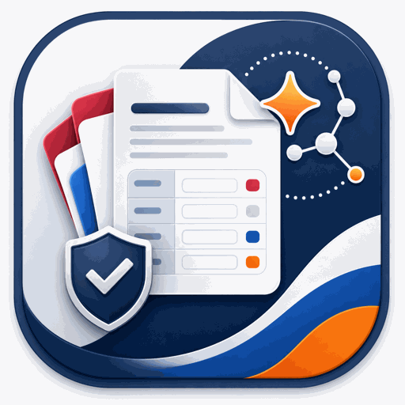

<div align="center">



<h1>NL Tax Agent Skills</h1>

<p>
  <strong>Turn scattered Dutch tax paperwork into a reviewable, source-cited workpack for manual Mijn Belastingdienst entry.</strong>
  <br />
  <sub>An Agent Skills plugin for Claude Cowork, Claude Code, ChatGPT Work, and Codex — annual 2025 &amp; voorlopige aanslag 2026, plus draft-only VAT, ICP, OSS, M/C and annual 2026 previews.</sub>
</p>

<a href="LICENSE"></a>
<a href="#claude-cowork"></a>
<a href="#chatgpt-work"></a>
<a href="#claude-code"></a>
<a href="#codex-cli"></a>
<a href="#-supported-workflows"></a>

</div>

> [!NOTE]
> This plugin **prepares workpacks for review**. It is not tax advice. You or an
> authorized person performs every Mijn Belastingdienst action; the assistant
> never opens the portal, signs, or submits.

## 🎯 What it does

Share your jaaropgaaf, mortgage statement, bank overview, and similar papers, or
just state amounts in the chat. Everything happens in the conversation. The
assistant:

1. **Reads your documents** directly and works out where each amount belongs,
   using source-cited Dutch tax notes for the workflow and year, with their
   review status made clear.
2. **Asks only the missing questions** that matter for your situation.
3. **Builds a workpack** listing every amount, its source, and any open
   questions, so you can check the numbers first.
4. **Maps supported amounts to their Mijn Belastingdienst fields** for your
   review and manual entry, with an optional checklist. Draft-only workflows
   provide a draft map and a checklist of blockers without amounts. After a
   correction, the assistant marks the affected map and checklist stale until
   you regenerate them.

You can also just ask how a rule works, for example “What is the Box 3
heffingsvrij vermogen for 2025?”. The answer comes from the bundled
source-cited notes, names the year and official source, says when a note still
awaits human review, and creates no files.

### How the skills work

Skills are instructions and reference material for the host's AI agent. The
agent selects the relevant skills, reads their supporting notes when needed,
reasons over the evidence, and decides which missing facts to ask for. A clear
VAT, ICP or OSS question goes directly to that topic. The agent asks whether
you mean an annual return or provisional assessment only when a 2026
income-tax request is ambiguous and the distinction changes the answer.

The plugin bundles Markdown/YAML guidance and sources, with no runtime
scripts, hooks or MCP server. Its workflows are agent-driven, not a
deterministic tax engine. Repository validators help maintainers check files,
source metadata and output contracts; behavioral evaluations check agent
responses. Neither replaces human tax-content review or your review of a
workpack.

### 💾 Your workpack file, only if you ask

The plugin writes nothing by default. Tax preparation can take a few sessions,
so the assistant offers to keep your workpack as a file when the workflow
starts, when you pause, and after the workpack is generated, each time as the
only question in its reply. Say yes, or “save my workpack” at any time, and it
keeps **one Markdown file per workflow** (and, for VAT, ICP and OSS, one per
period or scheme) in a `workspace/` folder inside your working folder:

| Workflow | Saved file |
|---|---|
| Annual return 2025 | `workspace/nl-tax-annual-2025-workpack.md` |
| Voorlopige aanslag 2026 | `workspace/nl-tax-provisional-2026-workpack.md` |
| Draft VAT return, 2025/2026 period | `workspace/nl-tax-vat-<year>-<period>-workpack.md` |
| Draft VAT correction of one filed 2025/2026 period | `workspace/nl-tax-vat-correction-<year>-<period>-workpack.md` |
| Draft ICP declaration, 2025/2026 period | `workspace/nl-tax-icp-<year>-<period>-workpack.md` |
| Draft OSS or IOSS return, 2025/2026 | `workspace/nl-tax-oss-<scheme>-<year>-<period>-workpack.md` |
| Draft M (migration) or C (nonresident) return | `workspace/nl-tax-international-<year>-<form>-workpack.md` |
| Draft annual return 2026 | `workspace/nl-tax-annual-2026-workpack.md` |

The period is the filing period the Belastingdienst assigned to you: a quarter
(`Q1`–`Q4`), a month (`M01`–`M12`), or, for VAT and ICP only, `Y` for an
assigned annual filing period. OSS Union and non-Union returns are quarterly
and IOSS returns are monthly; the scheme is `union`, `non_union` or `ioss`.
The form is `migration` or `nonresident`. Each confirmed period has its own
workpack; one quarter never replaces another quarter's file.

The file holds your facts with their sources, the open questions, the field
map, and the manual-entry checklist. It is yours: attach it (or keep it in the
working folder) to continue later, and delete it whenever you like. The plugin
never deletes files, never copies, moves, or renames your documents, and stops
updating the workpack when you say “stop saving”. Consent covers the current
conversation: in a new one, the assistant confirms a saved file before using
it, and asks before replacing an older file rather than merging into it. In a
cloud task whose folder may not outlast the session, you also get the workpack
as a download to keep.
A workpack from an older version (for example a 0.3 `return-pack.md`) is read
as an ordinary source document, not migrated.

## 🚀 Quickstart

After [installing](#-install), attach your documents and ask in plain language:

```text
Help me prepare my 2025 Dutch income-tax workpack. I have my year statement and mortgage summary.
```

```text
Help me request a 2026 voorlopige aanslag. Ask me for the estimates you still need.
```

You can also ask to change, review, or stopzetten an existing 2026 voorlopige
aanslag, or ask for both years in one sentence. The annual workpack is finished
first, then the 2026 flow continues. Each keeps its own facts and sources, and
its own workpack file if you save one. The workpack is generated only after you
confirm the final review.

<details>
<summary><strong>Invoke a skill directly</strong></summary>

```text
/nl-tax-agent-skills:nl-tax-intake annual
/nl-tax-agent-skills:nl-tax-provisional-assessment 2026 request
```

Replace `request` with `change`, `review`, or `stopzetten`. Syntax varies by
host; the natural-language request above works everywhere.

</details>

## 📦 Install

No shell or Python is needed on any host: the plugin ships no scripts, and
it writes nothing unless you ask it to save your workpack.

### Claude Cowork

1. Open Claude Desktop → **Cowork** → **Customize** → **Plugins**.
2. Under **Personal plugins**, select **+** → **Add marketplace** → **Add from a repository**.
3. Enter `https://github.com/cyanxxy/nl-tax-agent-skills` and select **Install**.

### Claude Code

```text
/plugin marketplace add cyanxxy/nl-tax-agent-skills
/plugin install nl-tax-agent-skills@nl-tax-agent-skills-marketplace
```

Or load a checkout for one session: `claude --plugin-dir ./plugins/nl-tax-agent-skills`.

### Codex CLI

```bash
codex plugin marketplace add cyanxxy/nl-tax-agent-skills --ref main
codex plugin add nl-tax-agent-skills@nl-tax-agent-skills-local
codex plugin list
```

### ChatGPT Work

Install **NL Tax Agent Skills** from the ChatGPT Plugin Directory once it is
published, then start a fresh task. On web and mobile, upload files to the
conversation or project; on desktop you can also select a local folder.

<details>
<summary><strong>Other paths</strong>: Cowork organizations, ZIP upload, unpublished ChatGPT build</summary>

<br />

**Cowork organization.** The organization marketplace accepts only private or
internal repositories. Mirror this repository privately, install the Claude
GitHub App on it, then add it under **Organization settings → Plugins → Add
plugin → GitHub**. Organization auto-sync runs on a merged pull request that
bumps the plugin version, so pull upstream releases in through a PR.

**ZIP upload.** Build a clean archive of the tracked plugin files, then upload
it under **Customize → Plugins → Personal plugins → +**:

```bash
git archive --format=zip -o nl-tax-agent-skills.plugin.zip HEAD:plugins/nl-tax-agent-skills
```

**Unpublished ChatGPT build.** Run `python3 submission/openai/build_bundle.py`
and use `dist/openai/nl-tax-agent-skills.zip` in the workspace's Apps
Management draft flow. This needs publisher verification and Apps Management
write permission.

</details>

## 🗓️ Supported workflows

| Workflow | Year | What you receive |
|---|:---:|---|
| ✅ Annual income-tax return | **2025** | Workpack and manual-entry field map |
| ✅ Winst uit onderneming (eenmanszaak / ZZP) | **2025** | Belastbare winst from your finalized profit-and-loss statement and balance, carried into the annual workpack |
| ✅ Voorlopige aanslag: request | **2026** | Estimate workpack and field map |
| ✅ Voorlopige aanslag: change | **2026** | Updated estimates and a change summary |
| ✅ Voorlopige aanslag: review | **2026** | Review summary and open questions |
| ✅ Voorlopige aanslag: stopzetten | **2026** | Guided checklist |
| ✅ / 📝 Rule questions | **2025 / 2026** | Sourced answer with the note's review status; extended topics remain draft-only; no files created |
| 📝 ZZP VAT return, and correction or suppletie of one filed period | **2025 / 2026** | Period-specific draft reconciliation, rubric map, KOR and special-case screening; no checklist with amounts |
| 📝 ICP declaration (opgaaf ICP) | **2025 / 2026** | Draft per period with customer aliases and a reconciliation with VAT rubric 3b; no checklist with amounts |
| 📝 OSS Union, OSS non-Union and IOSS returns | **2025 / 2026** | Draft per scheme and period, with each country's amounts and corrections kept separate; no checklist with amounts |
| 📝 M-biljet (emigration or immigration year) or C-biljet (nonresident) | **2025**; 2026 evidence only | Draft with residence periods, Dutch and foreign income, and qualifying-status proof; no checklist with amounts |
| 📝 Annual income-tax preparation (aangifte inkomstenbelasting 2026) | **2026** | Separate draft collection of actual evidence; final year-end evidence and the annual form are still pending |
| 🚫 VOF / maatschap / CV, DGA / BV, agrarisch, zeevarenden, staking, deceased person | 2025 | Routed to manual review |
| 🚫 Any workflow | 2027 | Blocked until 2027 sources are registered and validated |

✅ means reviewed and supported. 📝 means a **draft-only preview**: its official
sources still await human tax-content review, so the assistant never calls the
draft complete or ready to file, and a requested manual-entry checklist lists
only the blockers, without amounts. VAT, ICP and OSS returns are filed by you
or someone you have authorized (for example in Mijn Belastingdienst Zakelijk);
the assistant never files.

```text
Help me prepare a draft ZZP btw-aangifte for Q3 2026. I use the factuurstelsel and have my sales and purchase ledgers.
```

```text
Help me reconcile a correction to my filed Q2 2026 VAT return.
```

```text
Prepare my 2025 M-biljet. I emigrated in August 2025.
```

> [!WARNING]
> **Box 3.** Annual 2025 collects inputs for the **fictitious (forfaitair)**
> calculation and, when you supply them, **werkelijk rendement**. The workpack
> shows an informational comparison; supplying actual-return data is
> not a tax-method election, and the official filing environment performs the
> binding comparison and uses the more favorable amount. Provisional 2026 uses the
> **fictitious method only**.

Annual 2025 also covers the specific-healthcare-cost threshold, the EUR 925
limited-mobility transport forfait, the legacy DUO prestatiebeurs study-cost
exception, and jaarruimte/reserveringsruimte. For lijfrente limits, the agent
uses the result of the official Belastingdienst Hulpmiddel Lijfrentepremie.
Rules never carry over between tax years.

VAT preparation covers an ordinary Netherlands-established eenmanszaak or ZZP
business. Evidenced calculations for private use of a business car, mixed
taxable and exempt use, revision of investment goods and property, BUA, and the
margin scheme go through the read-only `nl-tax-vat-adjustments` helper.
Unresolved KOR transitions, import goods, undecided classifications or
elections, disputed valuations, and missing inputs remain review blockers. ICP
and OSS have their own workflows and files, so no amount is silently merged
into the domestic VAT return. You check and enter your customers' real VAT
identification numbers yourself; the workpack keeps only an alias.

The annual 2026 workflow collects actual evidence while the year is still open
and never reuses the 2025 or provisional forms; for an estimate of 2026, use
the voorlopige aanslag. M and C returns record residence periods, insurance
periods and qualifying-status proof; country-specific treaty questions stay
with a human tax professional.

| Draft-only skill | What it prepares |
|---|---|
| `nl-tax-vat-return` | A draft btw-aangifte for one confirmed period |
| `nl-tax-vat-correction` | A draft correction or suppletie for one already filed period |
| `nl-tax-icp` | A draft opgaaf ICP for one confirmed period |
| `nl-tax-oss` | A draft OSS Union, OSS non-Union or IOSS return for one scheme and period |
| `nl-tax-international-return` | A draft M-biljet or C-biljet for 2025, or evidence collection for 2026 |
| `nl-tax-annual-return-2026` | Draft evidence collection for the resident annual return 2026 |
| `nl-tax-vat-adjustments` | Read-only helper for the VAT workflows; it writes no file |

The remaining product gaps and the activation reviews are recorded in
[the VAT capability review](docs/maintainers/vat-support-2026-10-02.md) and
[the extended workflow review](docs/maintainers/extended-workflows-2026-10-02.md).

## 🔒 Privacy

The plugin runs inside your AI host (Cowork, Claude Code, ChatGPT Work, or
Codex), which processes the documents and conversation you share under its own
data terms. The plugin itself sends your data nowhere and fetches nothing by
default; when a workflow calls for a freshness check, the assistant may read
public official pages such as belastingdienst.nl. It stores nothing unless you
ask, and then only the workpack files described above (one per workflow, and
per period or scheme for VAT, ICP and OSS), in plaintext and until you delete
them. It never asks for a BSN, IBAN, or DigiD details, and the workpack never records a full BSN, IBAN, policy, contract, or
aanslag number. In this repository `workspace/` is git-ignored so taxpayer files are
never committed. See [PRIVACY.md](PRIVACY.md) for details, and
[SECURITY.md](SECURITY.md) to report an issue.

## 🤝 Contributing

Skill internals, the validation gate, and the release process are in
[CONTRIBUTING.md](CONTRIBUTING.md). CI runs the full gate on every push and
pull request. Report a suspected wrong rate, rule, or stale source through
GitHub Issues.

<div align="center">
<sub>
  <a href="LICENSE">Apache-2.0</a>
  &nbsp;·&nbsp;
  Submission is always manual through Mijn Belastingdienst
</sub>
</div>
